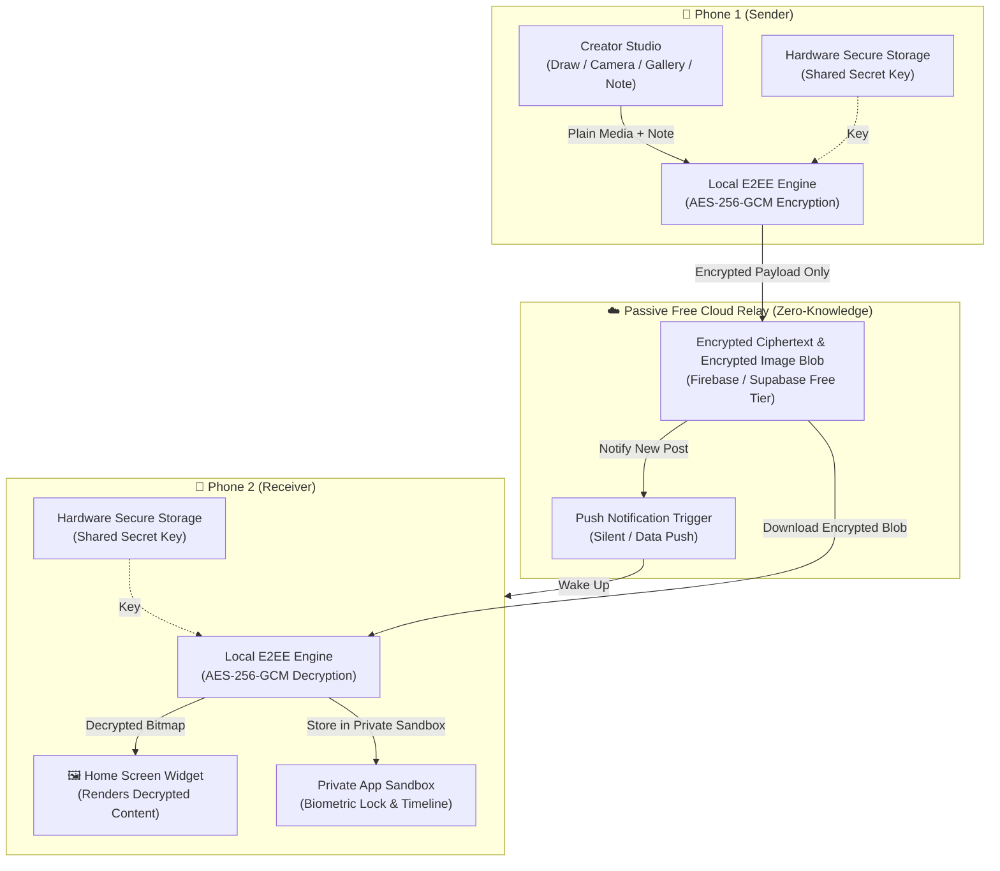

# Implementation Plan: TwinWidget (Private E2EE Home Screen Widget for Two)

Build a private, real-time home screen widget and creator app for you and your friend to exchange drawings, camera photos, gallery images, and sticky notes directly on each other's home screens. The app is designed for **zero server hosting** (free tier serverless relay) and **maximum security with End-to-End Encryption (E2EE)** so no data can be leaked or viewed outside your two paired phones.

---

## Architecture & Security Blueprint

---

## Key Pillars

### 1. 🛡️ End-to-End Encryption (Zero-Knowledge Security)
- **Zero-Leak Guarantee**: Photos, videos, drawings, and text are encrypted locally on your phone using **AES-256-GCM** before being transmitted.
- **Zero-Knowledge Cloud**: The server / cloud relay only stores meaningless scrambled ciphertext (`.enc` blobs). Neither database administrators nor any third-party can decrypt or view your photos.
- **Pairing Ceremony**:
  - One user generates a cryptographic pairing QR code or a 6-word secure pairing phrase.
  - The second user scans the QR code to securely exchange the cryptographic key.
  - The key is saved in the device's hardware-backed Keystore / Keychain.
- **Anti-Leak Sandbox**:
  - Received media is kept strictly inside the app's isolated private storage (not written to the phone's public photo gallery unless explicitly exported).
  - Optional **Biometric Lock** (Face ID / Fingerprint) when opening the app.
  - Prevent screenshots / screen recording toggle (`FLAG_SECURE` on Android).

### 2. ⚡ Zero-Hosting Architecture
- **No Servers to Manage or Pay For**:
  - Uses **Firebase Free Tier** (Cloud Firestore + Cloud Storage + Cloud Messaging FCM) or **Supabase Free Tier**.
  - 100% free forever for 2 users (handles thousands of updates per day well within free quotas).
  - Setup requires only adding a free configuration file; no custom backend servers to maintain.

### 3. 🎨 Creator Studio Features
- **Drawing Canvas**:
  - Smooth vector & brush drawing with customizable thickness, curated color palettes, neon/glow brushes, highlighter, and undo/redo.
  - Add text, stickers, and emoji overlays.
- **Live Camera**:
  - Snap real-time photos or short video loops with front/back camera.
  - Add quick captions and doodling over the photo.
- **Gallery Import**:
  - Pick any photo from gallery with crop, rotate, and doodle capabilities.
- **Sticky Notes / Moods**:
  - Colorful sticky notes with custom fonts, mood tags, and timestamp badges.
- **Send & Sync**:
  - One-tap Send button encrypts the payload, transmits it, and instantly wakes up your friend's home screen widget.

### 4. 🖼️ Home Screen Widget Experience
- **Interactive Home Screen Widget**:
  - Displays the latest drawing, photo, or note received from your partner.
  - Shows sender name/avatar and "Time ago" badge (e.g. *Sent 5m ago*).
  - **Tap-to-Reply**: Tapping the widget instantly launches the Creator Studio to send something back.
  - Auto-refreshes seamlessly upon background push notification.

---

## Technology Stack Recommendation

We recommend **React Native with Expo** (with `react-native-android-widget` and native extensions) or **Flutter**:

| Layer | Recommended Choice | Rationale |
|---|---|---|
| **Framework** | **React Native (Expo)** / **Flutter** | Cross-platform, rich UI/canvas rendering, easy local testing and standalone APK generation. |
| **Widget Engine** | **Native Android AppWidget / Glance** + **iOS WidgetKit** | Direct home screen widget rendering with high performance. |
| **Encryption** | **WebCrypto / Libsodium / AES-256-GCM** | Industry-standard authenticated encryption with tamper detection. |
| **Secure Storage** | **Expo SecureStore / Flutter Secure Storage** | Hardware-backed Android Keystore / iOS Keychain. |
| **Cloud Relay** | **Firebase (Free Tier)** | 0 hosting effort, built-in real-time listener & push notifications. |

---

## User Review Required

> [!IMPORTANT]
> **1. Target Devices**: What phones do you and your friend use?
> - Both Android (simplest to build and install directly via APK without app store review)
> - Both iOS (iPhone)
> - Mixed (One Android, One iPhone)

> [!IMPORTANT]
> **2. Preferred Cloud Relay**:
> - **Firebase Free Tier** (Recommended: includes silent push notifications for instant widget refresh)
> - **Supabase / P2P WebRTC / PeerJS** (Alternative zero-cost options)

---

## Proposed Implementation Phases

### Phase 1: Project Setup & Cryptography Engine (`TwinNotes/`)
- Initialize the mobile project in `c:\Users\Admin\OneDrive\Documents\------\AntiGravity Projects\TwinNotes`.
- Implement the **E2EE module**:
  - Key generation (AES-256-GCM key derived via PBKDF2/HKDF).
  - Pairing QR code generator and scanner.
  - Encrypt & Decrypt functions for text payloads and binary media blobs.
  - Hardware secure storage integration.

### Phase 2: Creator Studio UI & Canvas
- Implement the **Drawing Canvas**:
  - Touch-based freehand drawing with smooth curves, color picker, brush sizes, eraser, undo/redo.
- Implement the **Camera & Gallery Integration**:
  - In-app camera capture and photo picker with doodle/caption overlay.
- Implement the **Sticky Note Creator**:
  - Aesthetic sticky note templates with custom fonts and emoji pickers.

### Phase 3: Zero-Knowledge Relay & Sync
- Configure Firebase/Supabase client-side connector.
- Upload encrypted payload (ciphertext metadata + encrypted `.enc` image file).
- Download & decrypt pipeline on receiver device.
- Push notification trigger to wake receiver device in the background.

### Phase 4: Home Screen Widget Integration
- Implement the native **Android Home Screen Widget**:
  - Layout with image canvas, timestamp, and tap action to open app.
  - Widget background update handler that renders decrypted bitmap to widget remote views.
- (If iOS needed) Configure iOS WidgetKit extension.

### Phase 5: Privacy & Polish
- Add App Biometric Lock (Fingerprint/Face Unlock).
- Add Screen Protection (`FLAG_SECURE` to block screenshots/screen recording).
- Add History Scrapbook (offline encrypted archive of past moments).
- Build standalone installable package (APK) for direct phone installation.

---

## Verification Plan

### Automated & Logic Tests
- **Crypto Test**: Verify that encrypted data cannot be decrypted with a mismatched key, and that binary image encryption/decryption is byte-identical.
- **Sync Test**: Verify that mock send payloads properly trigger updates on a simulated receiver.

### Manual Verification Flow
1. **Device Pairing**: Pair two mock/test sessions via QR code.
2. **Drawing & Sending**: Draw a sketch, tap Send, verify encrypted payload in the relay.
3. **Widget Preview**: Verify that the widget receives and decrypts the image and displays it on the home screen.
4. **Security Check**: Inspect cloud payload to confirm zero plaintext or raw images exist in storage.
